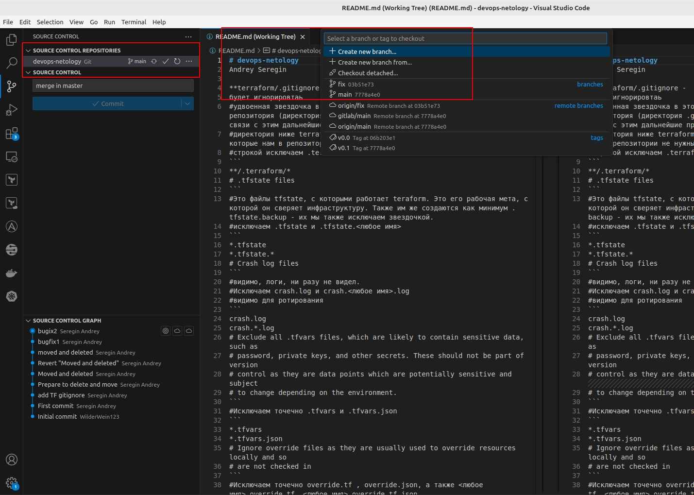

git занятие 2 задание 4 - подключение репозитория к Visual Studio Code



# devops-netology
Andrey Seregin

**terraform/.gitignore - 
будет игнорировтаь
#удвоенная звездочка в этом случае будет обозначать домашнюю директорию репозитория (директория .git будет прочитываться гитом на этом уровне). В связи с этим дальнейшие правила будут исходить от этого пути. 
#директория ниже terraform будет содержать рабочие данные terraform, которые нам в репозитории не нужны (да и занимают они немало).
#строкой исключаем .terraform/<любое имя>
```
**/.terraform/*
# .tfstate files
```
#Это файлы tfstate, с которыми работает teraform. Это его рабочая мета, с которой он сверяет инфраструктуру. Также им же создаются как минимум .tfstate.backup - их мы также исключаем звездочкой.
#исключаем .tfstate и .tfstate.<любое имя>
```
*.tfstate
*.tfstate.*
# Crash log files
```
#видимо, логи, ни разу не видел. 
#Исключаем crash.log и crash.<любое имя>.log
#видимо для ротирования
```
crash.log
crash.*.log
# Exclude all .tfvars files, which are likely to contain sensitive data, such as
# password, private keys, and other secrets. These should not be part of version 
# control as they are data points which are potentially sensitive and subject 
# to change depending on the environment.
```
#Исключаем точечно .tfvars и .tfvars.json
```
*.tfvars
*.tfvars.json
# Ignore override files as they are usually used to override resources locally and so
# are not checked in
```
#Исключаем точечно override.tf , override.json, а также <любое имя>_override.tf, <любое имя>_override.tf.json
```
override.tf
override.tf.json
*_override.tf
*_override.tf.json
# Ignore transient lock info files created by terraform apply
```
#точечно исключаем .terraform.tfstate.lock.info. Этот файл блокирует использование файлов teraform сторонними клиентами (пока не произойдет деплой или дестрой). 
```
.terraform.tfstate.lock.info

# Include override files you do wish to add to version control using negated pattern
# !example_override.tf

# Include tfplan files to ignore the plan output of command: terraform plan -out=tfplan
# example: *tfplan*

# Ignore CLI configuration files
```
#Конфигурационные файлы terraform (по аналогии с классическим /etc/rc.*)
#исключаем точечно .terraformrc, terraform.rc
```
.terraformrc
terraform.rc
```
